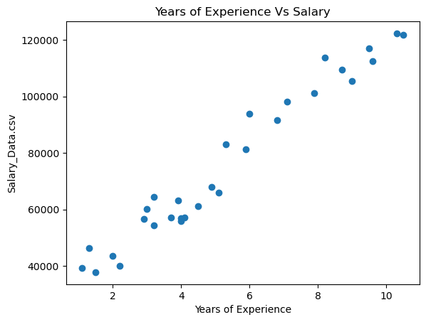

# What is linear regression?  
Linear regression is a fundamental __statistical method__ used to model the relationship between a dependent variable (must be a __continuous variable__) and one or more independent variables. It helps us understand the relationship between variables and predict how one variable will change with respect to another one. \
In this repository, we demonstrated how to develop a very basic mulitiple regression model from scratch using only numpy library.  

    
    

 

##  Features
- **Cost Function**: Mean Squared Error (MSE) implementation
- **Gradient Descent Optimization:** Manual calculation of gradients for parameter updates
- **Data Visualization:** Scatter plots and regression line visualization
##  Dataset
*The project uses Salary_Data.csv containing:*
- **YearsExperience:** Independent variable (features)
- **Salary:** Dependent variable (target)

##  Mathematical Foundation
- **Linear Regression Equation:** $f(x) = wx + b$
- **Cost Function:** $J(w,b) = (1/2m) \sum{(f(x) - y)}^2$ 
- **Gradient Descent Update:** Where \
        $w = w - \alpha \times \frac{\partial J}{\partial w}$ \
        $b = b - \alpha \times \frac{\partial J}{\partial b}$

##  Key Takeways
*This implementation helps understand:*
- How linear regression works mathematically
- The role of derivatives in optimization
- How to use object oriented programming
- How learning rate affects training
- The relationship between cost and model performance

