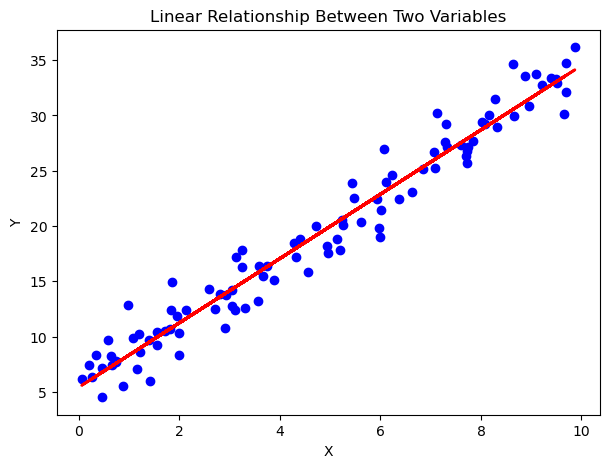

#  Motivation 
Machine learning (ML) library like scikit learn has made it very easy to apply ML models without getting your hands dirty. As a result, it is easy forget what is happening behind the hood. Keeping this in mind, I wanted to develop linear regression model from scratch to have a clearer understanding about the math behind it and how it's done in python.

#  What is linear regression?  
Linear regression is a fundamental statistical method used to model the relationship between a dependent variable and one or more independent variables. It helps us understand the relationship between variables and predict how one variable will change with respect to another one. The following figure shows what do we mean by linear relationship. It shows how a change in X (__Independant variable__) impacts y (__Dependent variable__). 

    

 

***This repository demonstrated how to develop a very basic multiple linear regression from scratch.***  

##  Mathematical Foundation
- **Regression Equations:** Simple Linear Regression: $y = f(x)$; $y = wx + b$, Multiple Linear Regression: $y = x_1* w_1 + x_2 * w_2 + ...... + x_n*w_n + b$
- **Cost Function (Mean Squared Error):** $J(w,b) = (1/2m) \sum{(f(x) - y)}^2$ 
- **Gradient Descent Update:** Where \
        $w = w - \alpha \times \frac{\partial J}{\partial w}$ \
        $b = b - \alpha \times \frac{\partial J}{\partial b}$

##  Dataset
*The project uses Salary_Data.csv containing:*
- **YearsExperience:** Independent variable (features)
- **Salary:** Dependent variable (target)

##  Key Takeways
*This implementation helps understand:*
- What are the mathematical equations involved in linear regression
- The role of derivatives in optimization and convergence
- How weight and bias works
- How to use object oriented programming
- How vectorization speeds up machine learning
- The Importance of normalization
##  Results

    
    

 

